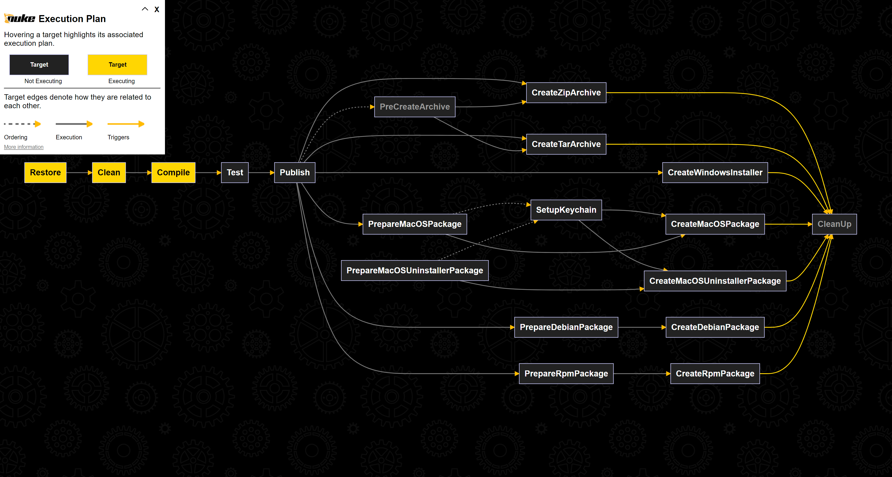

# Technical Stuff

Keyboard Switch is written using [C#](https://github.com/dotnet/csharplang) and [.NET 9](https://dotnet.microsoft.com/en-us/download/dotnet/8.0). Following is the list of technologies used in this app and some other technical aspects.

## UI

The Keyboard Switch Settings app is written using [Avalonia](https://avaloniaui.net), a cross-platform UI framework for .NET. I chose it because unlike other UI frameworks for .NET, it's cross-platform, and I had to do literally nothing for it to work on macOS and Linux as well. The styles are provided by [FluentAvalonia](https://github.com/amwx/FluentAvalonia), the [Devolutions macOS theme](https://github.com/Devolutions/avalonia-extensions), and Avalonia's simple theme.

Previous versions of the app used .NET Framework and WPF. Back then I didn't expect to have it working on different platforms.

Previous versions of the app also included a tray icon so you could see that the app is running. I removed it in version 3.0 as I don't see much value in keeping it and cluttering your tray.

## Core Logic

### Windows

The service app is just an app which runs in the background. I could have made it into a Windows service but decided against it when I read somewhere that Windows services cannot set up keyboard hooks. I didn't actually verify this info, so I'm not sure it's correct, but the background app approach works just fine, so it's likely to stay this way.

The service app calls various native functions from the Windows' _user32.dll_. It uses [Vanara](https://github.com/dahall/Vanara) to call them.

In the previous versions (up to 3.0) the service and the settings app were not separated. It was just an app running with a hidden window which showed up when you opened it. Having a hidden window always loaded is not that great of an idea, even though it used very little RAM.

### macOS

On macOS, the service app runs as a _launchd_ service. _launchd_ provides the ability to start at login. The settings app starts the service app through _launchd_ as well.

macOS 10.15+ is required since it's the oldest version still supported by .NET.

The service app uses multiple native macOS frameworks:

* _CoreFoundation_ — for low-level string, array, and pointer manipulation.
* _CarbonCore_ (part of _CoreFoundation_) — for translating key codes with layout info into Unicode characters.
* _CoreGraphics_ — for simulating keyboard events.
* _HIToolbox_ — for working with keyboard layouts.
* _AppKit_ — for working with the clipboard.

### Linux

At first, I decided to run the app as a _systemd_ service, but it proved not to provide much value, so I've since reverted this decision.

The service app uses X11, especially the X Keyboard Extension, and the X Test Extension. Currently it doesn't work on Wayland, even through XWayland. It calls various native Xlib functions using P/Invoke directly.

The app interacts directly with X11 for clipboard integration — the code for this integration is based on code from Avalonia. It can also use [xsel](https://github.com/kfish/xsel) for clipboard integration instead.

If the Linux desktop environment is GNOME, then the app switches layouts a little differently than in other desktop environments. GNOME doesn't let apps switch layouts using X11 directly — it will immediately switch it back. Instead, the settings app adds a small GNOME Shell extension (which is simply called Switch Layout) and the app switches layouts through it. GNOME should be made aware of this extension after installation; hence you should restart it after starting the settings app. If you don't then the app will still work but won't be able to switch layouts until you log out or reboot.

### The Settings App

The core logic of the settings app is implemented using [ReactiveUI](https://www.reactiveui.net) as the MVVM framework. Also, [Splat](https://github.com/reactiveui/splat) is used for service location.

## App Structure

Keyboard Switch and Keyboard Switch Settings are published as self-contained single-file applications. The size difference between single-file applications and standard applications with shared libraries is negligible since single-file applications can be compressed.

On macOS, the two applications are located in separate directories — this is done because on macOS every application should be contained inside a bundle.

## The Global Keyboard Hook

The app uses [libuiohook](https://github.com/kwhat/libuiohook) to create a global keyboard hook. The library is cross-platform and supports almost all popular OSes and architectures. Since this library is native and it's non-trivial to build, I've developed a .NET wrapper for it, [SharpHook](https://github.com/TolikPylypchuk/SharpHook), so that I don't have to deal with a native library in this project.

Previously, the app used a Windows keyboard hook directly, but that doesn't work on other systems.

## Preferences

Preferences are stored in the user's local app data folder (under the _Keyboard Switch_ directory) on Windows. I didn't put it into the normal app data folder because that one is shared if you use the same Windows account on multiple machines, and that kind of defeats the purpose of this app being configured for each machine individually.

On macOS, the settings are stored in the _\~/Library/Application Support/Keyboard Switch_ directory.

On Linux, the settings are stored in the _\~/.config/keyboard-switch_ directory.

This app stores settings as plain JSON files.

## Logging

This app uses a plain-text log file to log the stuff it’s doing and errors it encounters along the way. [Serilog](https://serilog.net) is used as the logging library.

On Windows and Linux, the log file is stored in the same folder as the preferences, and on macOS, it's stored in the _\~/Library/Logs/Keyboard Switch_ directory. The log file is rolled over after reaching 10 MB.

If you really want to (and know how), you can change the logging configuration in the _appsettings.json_ file. On Windows and Linux, this file is located in the same folder as the app itself. On macOS, this file is located in the bundle's resources folder, and you probably shouldn't change it as it may break the bundle's signature (though I'm not sure about that).

## Tests

There are very few tests and only for the core functionality. Honestly, I don't even know how to test the rest, because the rest of the app is essentially creating system-wide side effects, so don't think it's really testable. As for the settings app, well, I could test it, but that would take a lot of time, and the app is pretty simple, so I don't plan on doing it in the nearest future.

## Docs

The docs are built and hosted on [GitBook](https://www.gitbook.com).

Previously these articles were built using [Jekyll](https://jekyllrb.com) and hosted on [GitHub Pages](https://pages.github.com), and used the [Minimal Mistakes theme](https://mmistakes.github.io/minimal-mistakes).

## Installers

[WiX Toolset 6.0](https://www.firegiant.com/wixtoolset) is used to create the Windows installer. Previously, [WixSharp](https://github.com/oleg-shilo/wixsharp) was used, but the installer is really simple, so there is no need for it. Also, WixSharp requires .NET Framework, while WiX 4.0+ doesn't require it anymore.

The installer package for macOS is created using the default macOS tools.

The deb and RPM installers for Linux are also created using the default CLI tools.

## Building from Source

You can build Keyboard Switch from source if you like. All projects require .NET 8.

### The Projects

The app consists of 10 projects grouped into 3 folders:

* src:
  * _KeyboardSwitch_: The Keyboard Switch service itself
  * _KeyboardSwitch.Core_: Core functionality and interfaces for all projects
  * _KeyboardSwitch.Settings_: The Keyboard Switch Settings app
  * _KeyboardSwitch.Settings.Core_: The core logic of the settings app
  * _KeyboardSwitch.Windows_: The implementation of the core functionality for the Windows platform
  * _KeyboardSwitch.MacOS_: The implementation of the core functionality for the macOS platform
  * _KeyboardSwitch.Linux_: The implementation of the core functionality for the Linux platform
* test:
  * _KeyboardSwitch.Test_: The unit test project
* build:
  * _KeyboardSwitch.Build_: The NUKE project for building Keyboard Switch
  * _KeyboardSwitch.Windows.Installer_: The WiX installer project

### Building the App Itself

Keyboard Switch uses [NUKE](https://nuke.build) as its build system. It's not required to build Keyboard Switch, but it greatly simplifies creating the target artifacts. You should call the `./build.cmd` script from the root folder to run NUKE (the script is cross-platform).

The following targets are available (the default target is `Compile`):

* `Restore` — runs `dotnet restore` for all projects.
* `Clean` — runs `dotnet clean` for all projects.
* `Compile` — runs `dotnet build` for all projects.
* `Test` — runs `dotnet test` for the test project.
* `Publish` — runs `dotnet publish` for the _KeyboardSwitch_ and _KeyboardSwitch.Settings_ projects.
* `CreateZipArchive` — creates a _zip_ archive which contains a portable distribution of Keyboard Switch.
* `CreateTarArchive` — creates a _tar.gz_ archive which contains a portable distribution of Keyboard Switch.
* `CreateWindowsInstaller` — creates a Windows installer.
* `PrepareMacOSPackage` — prepares all files required for a macOS package.
* `CreateMacOSPackage` — creates a macOS package.
* `PrepareMacOSUninstallerPackage` — prepares all files required for a macOS uninstaller package.
* `CreateMacOSUninstallerPackage` — creates a macOS uninstaller package.
* `PrepareDebianPackage` — prepares all files required for a deb package.
* `CreateDebianPackage` — creates a deb package.
* `PrepareRpmPackage` — prepares all files required for an RPM package.
* `CreateRpmPackage` — creates an RPM package.

The Windows installer can be created on any OS. The macOS packages can only be created on macOS and require an Apple Developer account and certificates. The deb and RPM packages can only be created on Linux.

The following parameters are available:

* `Configuration` — `Debug` or `Release`. All targets except `Restore`, `Clean`, `Compile`, and `Test` require `Release` which is the default.
* `TargetOS` — `Windows`, `macOS`, or `Linux`. The currently running OS is the default. Windows installer requires `Windows`. macOS packages require `macOS`. Linux packages require `Linux`.
* `Platform` — `x64` or `arm64`. The currently running platform is the default.
* `PublishSingleFile` — `true` or `false`. All targets after `Publish` require `true`.
* `OutputFileSuffix` — the suffix to use on output files before the extension. For example, portable Windows distributions use the `win` suffix.

The following parameters are available for building macOS packages:

* `AppleId` — your Apple developer ID.
* `AppleTeamId` — your Apple team ID.
* `AppleApplicationCertificate` — the ID of your Apple application certificate.
* `AppleInstallerCertificate` — the ID of your Apple installer certificate.
* `NotaryToolKeychainProfile` — the Keychain profile to be used by `notarytool` when notarizing the package.

There are more parameters available for macOS, but they are only used when running in GitHub Actions. Certificates must be stored in Keychain for macOS packages to be built.

Here is the NUKE execution plan which shows the dependencies between targets:

<figure><figcaption>
NUKE execution plan
</figcaption></figure>
