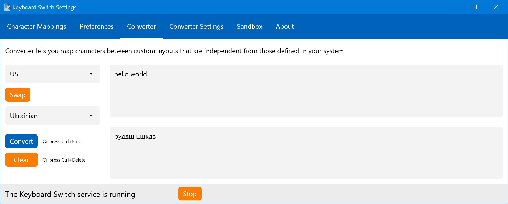
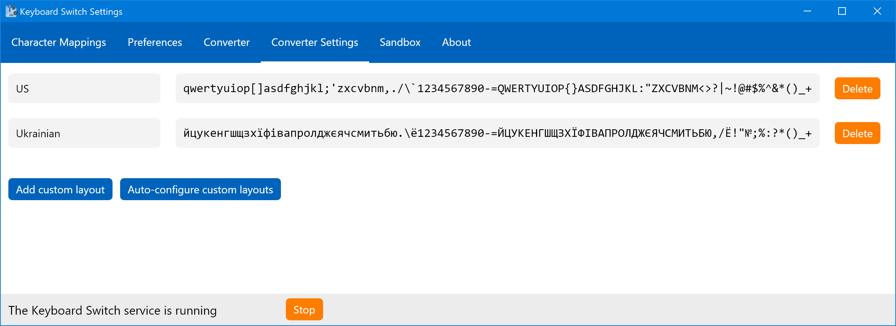

# Converter

Converter lets you manually convert text between arbitrary layouts, not just those installed in your system.


Converter is a very niche feature. Chances are that you'll never need to use it and never even think of using it. Moreover, it has nothing to do with the main functionality of the app - switching text in the background. Feel free to skip this article if you're not interested.


## The Converter Functionality

Here's how the Converter tab looks (when it's configured):

The tab consists of two main parts:

* Text area
* Configuration area

Text area is where you input text and get the output. Quite straightforward.

Configuration area is where you configure how to switch the text. You can select the source layout and the target layout, and do the actual switching or clearing of the output.

Custom layouts are configured in the Converter Settings tab, discussed in the next section.


At least two custom layouts are required to enable the converter.


## Converter Settings

The Converter Settings tab lets you configure custom layouts for the converter. Here's how it looks:

It's pretty similar to the Character Mappings tab, and the way configuration of characters works is identical. The main difference is that you can control what's shown here. You can add layouts, remove, or rename them. You can't change the order of the layouts, but it doesn't actually matter here. You can't have two or more layouts with the same name.

Just like with Character Mappings, you can auto-configure custom layouts, but here you have to select layouts to configure first. Here's how the settings for auto-configuration look:

You can select layouts using the drop-down. It includes all keyboard layouts that you can choose in Windows. After you selected the layouts, and clicked _Save_, the app will load those layouts into Windows, execute the same auto-configuration algorithm as it does in the Character Mappings tab, and then unload those layouts from the system.


It's best to auto-configure all layouts you want to add at once. If you auto-configure them one by one, then some characters may not be mapped correctly since auto-configuration will remove mappings which are not defined in _all_ layouts.


## Why the Converter Was Added

Now that you know what the converter does, you'll agree that its use is extremely limited. And to be honest, the reason I've added it is not usability, it's sentimentality. A very long time ago, when the idea that there should be a way to easily switch mistyped text first occured to me, I created an app (simply called Converter) which did just that, but it didn't do it in the background. You had to enter text in the window much the same way you have to do it in the converter in this app. It was actually one of the first usable apps that I have ever created. And this app even helped me out once, when I had to use a computer abroad and it didn't have the Ukrainian layout installed. So after releasing version 2 of this app in 2018 I thought that it would be nice to add the converter feature to the next release even though it will probably not be used by anybody (not even me). In addition, I've learned a couple interesting things about how keyboard layouts work in Windows when I implemented this feature. So here we are.
