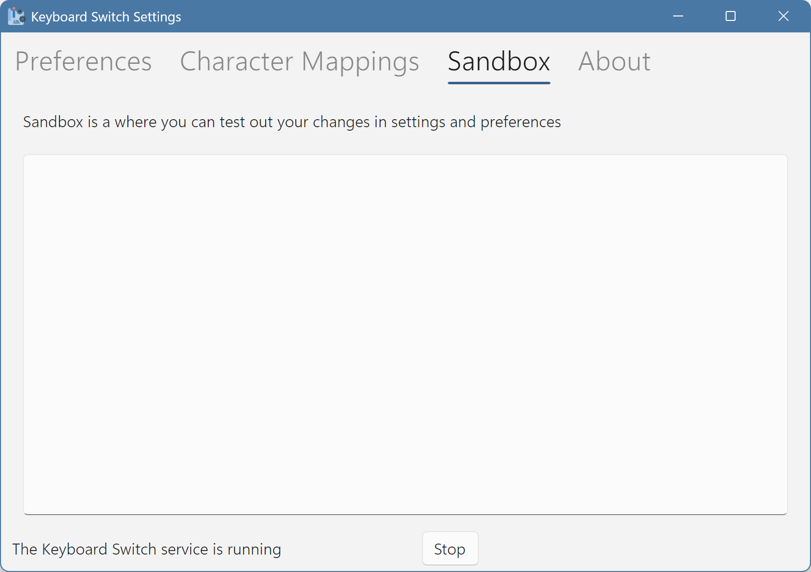
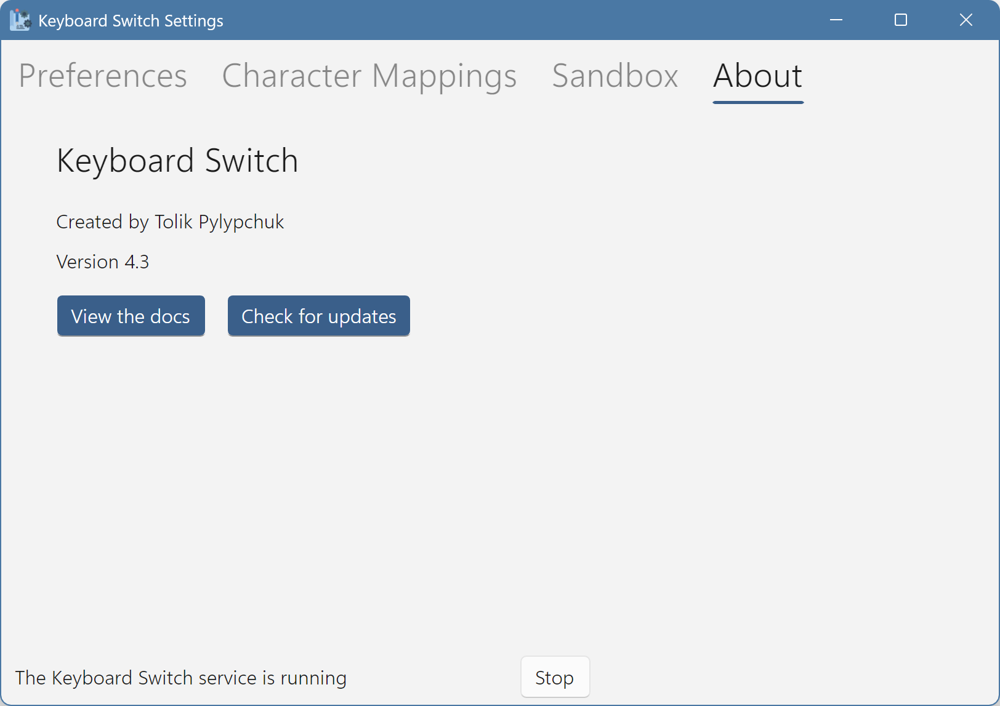

# Other Tabs

Other tabs in the settings app include the Sandbox tab and the About tab.

## Sandbox

Sandbox is absurdly simple – it's just a text box. That's it! Here's how it looks:

<figure><picture><source srcset="../.gitbook/assets/v4.3-screen-sandbox-dark.png" media="(prefers-color-scheme: dark)"></picture><figcaption>
The sandbox tab
</figcaption></figure>

Sandbox lets you play around with switching text when you change the app's settings. It contains no logic whatsoever. It's literally just a text box.

## About

The About tab contains some general info about the app. Here's how it looks:

<figure><picture><source srcset="../.gitbook/assets/v4.3-screen-about-dark.png" media="(prefers-color-scheme: dark)"></picture><figcaption>
The about tab
</figcaption></figure>

If you want more info, you can view the docs (these very pages).

You can also check whether updates for the app are available. If they are indeed available, then you can go to the releases page on GitHub to get them. The app doesn't support auto-updating, so you will have to install a newer version yourself. Remember that you should stop the service app before installing a newer version.

That's it for the settings app. If you want technical info about Keyboard Switch, you can check out the next articles.
