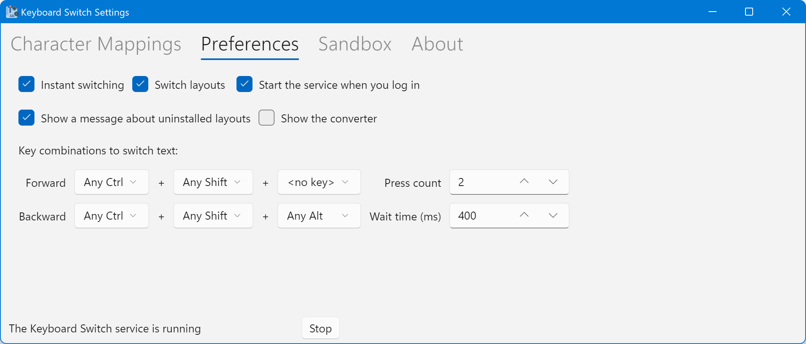

# Preferences

The Preferences tab contains other settings which control the behavior of the Keyboard Switch service. Here's how it looks:

Following is the discussion on the many fields that are in this tab.

## Check-Boxes

There are five check-boxes at the top of the Preferences tab:

* Instant switching
* Switch layouts
* Start the service when you log in
* Show a message about uninstalled layouts
* Show the converter

The first check-box controls whether the Keyboard Switch service should use instant switching or not. The default is yes. The service app needs to access the text to transform it, and for that it uses the clipboard. When instant switching is enabled, the service app will simulate pressing _Ctrl+C_ (or _Command+C_ on macOS) to copy text into the clipboard. This is why you must first select the text before you let the service app switch it. After transforming the text, the service app will put it back into the clipboard and if the instant switching mode is enabled, it will simulate pressing _Ctrl+V_ (or _Command+V_ on macOS) to paste the new text instead of the selected text. If you disable this mode, you will have to manually copy the text before switching, and then paste it afterwards. In addition, when this mode is enabled, the app will try to preserve the text that was in clipboard previously, and restore it after switching (if the clipboard didn't contain text before switching, e.g. a file or a picture, it won't be restored).

The second check-box controls whether the service app should switch the layout for you after transforming the text. The default is yes, and there's probably no reason to ever disable it. It just reduces the number of actions you have to do in order to get back on track with typing the text.

The third check-box lets you control whether the service app will start when you log in. When you open the settings app for the first time, it configures the service app to run at startup automatically.

The fourth check-box controls whether the settings app should show a warning about uninstalled layouts. If you install a new layout in the system, you should open the settings app and configure it in the Character Mappings tab. If you uninstall a layout, its configuration will still be saved in the app's settings, but it will essentially be redundant - the layout is not present in the system anymore and hence the service app won't need its configuration. When you uninstall a layout and open the settings app, it will show you a warning and a button to delete the unused configuration. If you want to ignore this warning for whatever reason, then uncheck this check-box.

The fifth check-box controls whether the converter is visible. Since this is a very niche feature, you will likely never need to use it, so it's hidden by default.

## Switch Settings

You can switch text just by pressing modifier keys. This is similar to switching keyboard layouts in Windows itself - the default key combination to switch layouts in Windows is _Alt+Shift_. You can control which key combination to press to switch text and how many times. The setting contains four fields:

* Modifier keys for switching forward
* Modifier keys for switching backward
* Press count
* Wait time (in milliseconds)

You can select _Ctrl_, _Alt_/_Option_, _Shift,_ and _Win_ (also known as _Super_, _Meta_, or _Command_), or their combination as modifier keys for switching. The default is _Ctrl+Shift_ to switch forward, and _Ctrl+Alt+Shift_ (_Ctrl+Option+Shift_ on macOS) to switch backward.

You can also control how many times you should press those modifier keys to switch the text. The default is 2. Max value for this field is 10, but even that is way too much. Min value is 1, but be careful if you set it to 1, because then it would be easy to press it by accident.

Wait time controls how much time the service app waits before deciding that you're not intending on switching text. For example, let's say that the press count is 3, and wait time is 400 ms (which is the default value). You press the key combination. The app then waits for 400 ms to see whether you will press the key combination again. If you don't, then it realizes that you don't want to switch text. If you press the key combination again within this time, the app will then wait again for 400 ms. You then press the key combination for the third time, and the app realizes that you want to switch the text. The min value for this field is 100 ms (which usually makes the app give up waiting much too fast), and the max value for this field is 1000 ms (so, 1 full second, which is usually too slow). 400 ms is the sweet spot, but maybe it won't be for you. You should play around with this setting to figure out which value works best for you.


**Note:** Wait time is ignored if the press count is set to 1.

