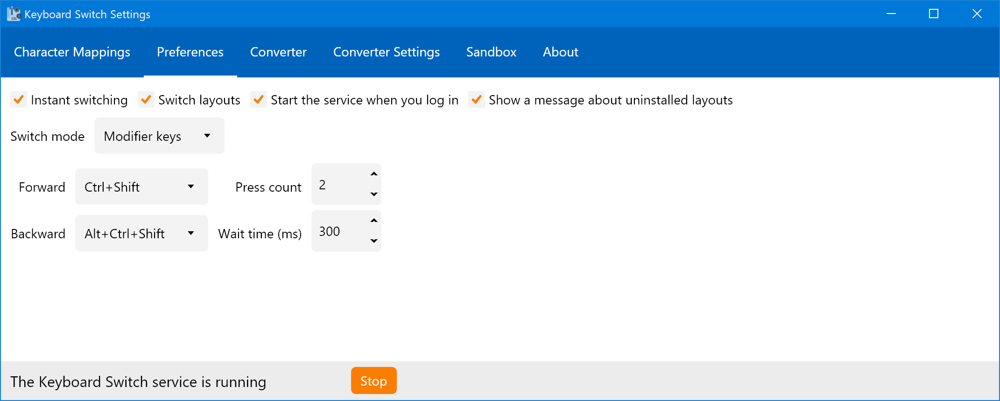
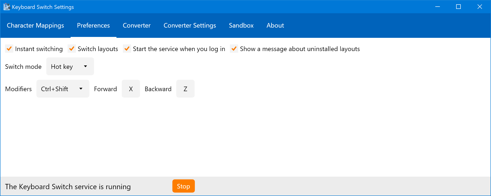

# Preferences

The Preferences tab contains other settings which control the behavior of the Keyboard Switch service. It has two main looks, based on the switch mode setting:

Following is the discussion on the many fields that are in this tab.

## Checkboxes

There are four checkboxes at the top of the Preferences tab:

* Instant switching
* Switch layouts
* Start the service when you log in
* Show a message about uninstalled layouts

The first checkbox controls whether the Keyboard Switch service should use instant switching or not. The default is yes. The service app needs to access the text to transform it, and for that it uses the clipboard. When instant switching is enabled, the service app will simulate pressing <kbd>Ctrl</kbd>+<kbd>C</kbd> to copy text into the clipboard. This is why you must first select the text before you let the service app switch it. After transforming the text, the service app will put it back into the clipboard and if the instant switching mode is enabled, it will simulate pressing <kbd>Ctrl</kbd>+<kbd>V</kbd> to paste the new text instead of the selected text. If you disable this mode, you will have to manually copy the text before switching and then paste it afterwards.

The second checkbox controls whether the service app should switch the layout for you after transforming the text. The default is yes, and to be honest, I see no reason to ever disable it. It just reduces the number of actions you have to do in order to get back on track with typing the text.

The third checkbox lets you control whether the service app will start when you log in. The default is yes if you installed the app using a Windows installer, and no if you're using the portable version.

The fourth checkbox controls whether the settings app should show a warning about uninstalled layouts. If you install a new layout in the system, you should open the settings app and configure it in the Character Mappings tab. If you uninstall a layout, its configuration will still be saved in the app's settings, but it will essentially be redundant — the layout is not present in the system anymore and hence the service app won't need its configuration. When you uninstall a layout and open the settings app, it will show you a warning and a button to delete the unused configuration. If you want to ignore this warning for whatever reason, then uncheck this checkbox.

## Switch Mode

The service app supports two switching modes in relation to the magic key combinations you press to switch the text: modifier keys (the default), and hot key.

### Modifier Keys

This is the default and recommended switch mode. With it you can switch text just by pressing modifier keys. This is similar to switching keyboard layouts in Windows itself — the default key combination to switch layouts in Windows is <kbd>Alt</kbd>+<kbd>Shift</kbd>. You can control which key combination to press to switch text and how many times. The setting contains four fields:

* Modifier keys for switching forward
* Modifier keys for switching backward
* Press count
* Wait time (in milliseconds)

You can select <kbd>Ctrl</kbd>, <kbd>Alt</kbd>, <kbd>Shift</kbd> or their combination as modifier keys for switching. The default is <kbd>Ctrl</kbd>+<kbd>Shift</kbd> to switch forward, and <kbd>Ctrl</kbd>+<kbd>Alt</kbd>+<kbd>Shift</kbd> to switch backward. The app doesn't distinguish between left and right modifier keys.

You can also control how many times you should press those modifier keys to switch the text. The default is 2. Max value for this field is 10, but even that is way too much. Min value is 1, but be careful if you set it to 1, because then it would be easy to press it by accident.

Wait time controls how much time the service app waits before deciding that you're not intending on switching text. For example, let's say that the press count is 3, and wait time is 300 ms (which is the default value). You press the key combination. The app then waits for 300 ms to see whether you will press the key combination again. If you don't, then it realizes that you don't want to switch text. If you press the key combination again within this time, the app will then wait again for 300 ms. You then press the key combination for the third time, and the app realizes that you want to switch the text. The min value for this field is 100 ms (which in my opinion makes the app give up waiting much too fast), and the max value for this field is 1000 ms (so, 1 full second, which as for me is too slow). 300 ms is the sweet spot for me, but maybe it won't be for you. You should play around with this setting to figure out which value works best for you.


Wait time is ignored if the press count is set to 1.


### Hot Key

The hot key switch mode was carried over from the previous version of the app and is not recommended anymore. It lets you specify which key combination (modifier keys + normal key) to press to switch the text. There are three fields for this mode:

* Modifier keys
* Forward key
* Backward key

The default modifier keys are <kbd>Ctrl</kbd>+<kbd>Shift</kbd>, and the default keys are <kbd>X</kbd> for forward and <kbd>Z</kbd> for backward. So, to switch forward, you just press <kbd>Ctrl</kbd>+<kbd>Shift</kbd>+<kbd>X</kbd> and that's it. The fields for keys only allow a limited set of keys (arrow keys or navigation keys are not allowed for example).

This mode is not recommended anymore because it may interfere with the app you're using at the moment — the app itself may do something when you press, say, <kbd>Ctrl</kbd>+<kbd>Shift</kbd>+<kbd>X</kbd>. There's no way of knowing that the key combination you selected is never used in any app ever.


You can't change the switch mode if there are unsaved changes in the Preferences tab. Save or cancel the changes if you want to change it.

