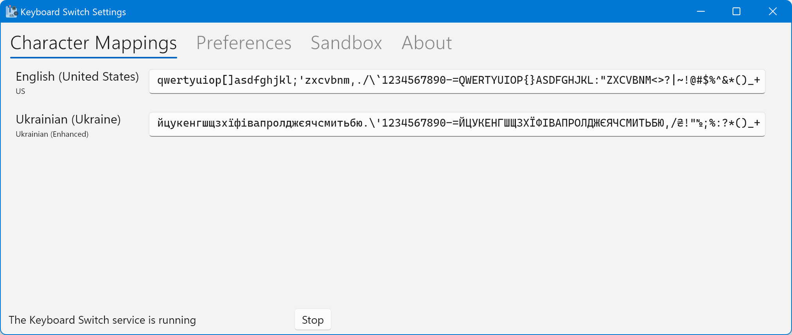

# The Settings App


Version 4.0 is not yet completed. You'll have to get a [nightly build](https://github.com/TolikPylypchuk/KeyboardSwitch/actions/workflows/main.yml) if you want to install the app. It works on Windows and Linux; macOS support will come in a future release. The app itself and these docs may change at any moment without warning until version 4.0 is released.


Keyboard Switch Settings is a simple app which controls the behavior of the Keyboard Switch service. You can find the app in the list of your installed apps (e.g. the Start menu on Windows). Here's how it looks:

The app is composed of six tabs:

* Character mappings: contains the settings which tell Keyboard Switch how to transform characters between layouts
* Preferences: contains other settings
* Converter: lets you manually convert text between arbitrary custom layouts (hidden by default)
* Converter settings: contains the list of custom layouts for the converter (hidden by default)
* Sandbox: lets you play around with switching the text
* About: contains info about the app

At the bottom there's a strip with the status of the Keyboard Switch service. If it's not running, you can press the _Start_ button to start it manually (although usually you wouldn't do that because the service will start when you log in). If the service is running, you can stop it by pressing the _Stop_ button. It won't actually kill it - it will send a _stop_ command, and the service will do some clean-up and stop on its own. If it's taking a long time to stop, it may mean that something went wrong. In that case you can force it to stop by pressing the _Kill_ button.


**Note:** If you change anything in the settings app, you can save it or cancel it. When you save it, the settings app sends a notification to the service app (if it's running) about changes in configuration so you don't have to restart the service after saving.


The following articles describe each tab of the settings app in more detail.
